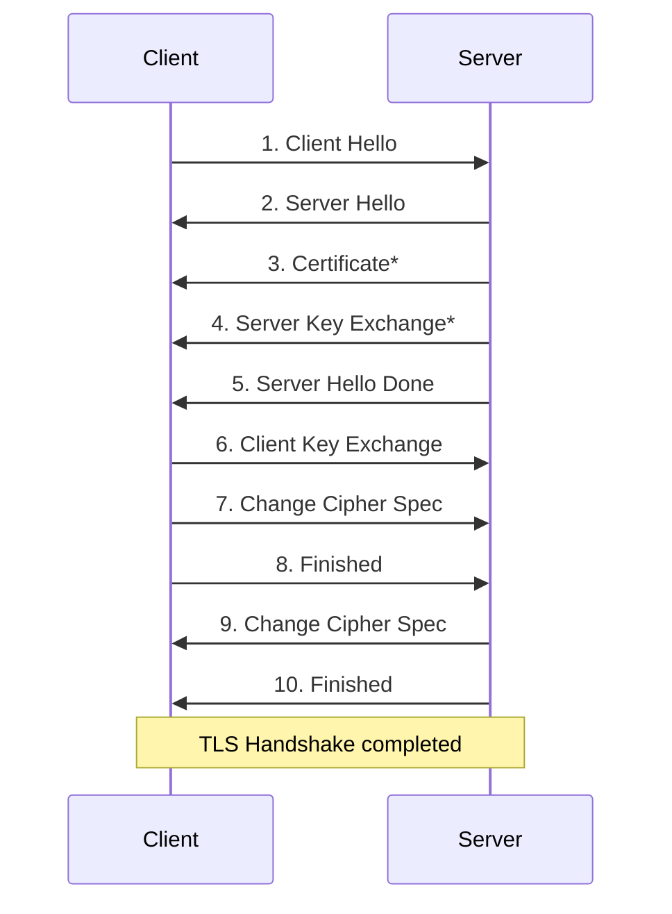
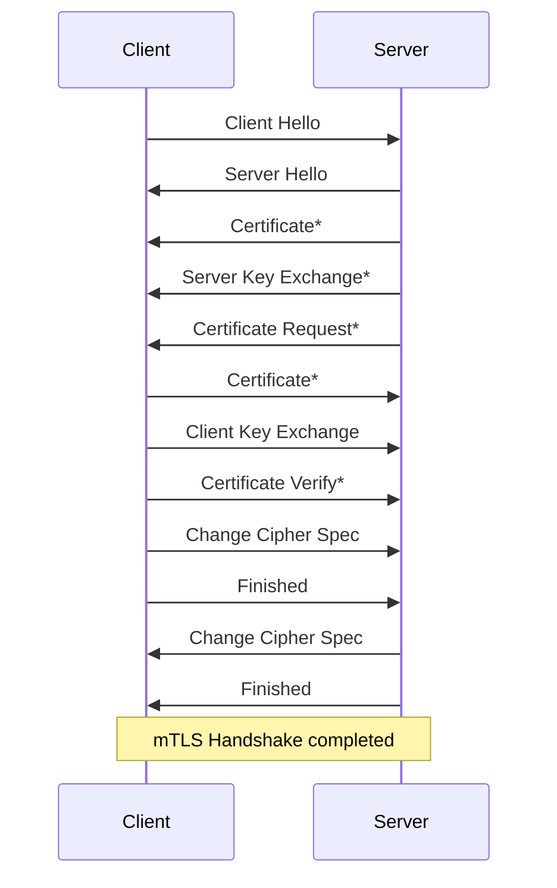

# Vault PKI - mTLS demo

> Demo App Github : <https://github.com/Great-Stone/vault-mtls-demo>

## 1. mTLS Explained

### 1.1 SSL and TLS

SSL (Secure Sokets Layer) is a standard technology that encrypts data sent between a client and a server and provides security for internet connections. It prevents malicious outsiders from viewing and intercepting information sent between the client and server.

Transport Layer Security (TLS) is a more advanced security technology that succeeds the now-deprecated SSL. It builds on SSL 3.0, but is not compatible. The latest version is TLS 1.3.

- In TLS 1.2, the encryption method and key exchange communication were included in the handshake process, which required two additional requests.
- In TLS 1.3, we added a way to minimise the handshake process to communicate encryption, improving the speed and security of HTTPS communication.
  - Adding 0-RTT mode to handshakes
  - Removed static RSA and Diffie-Hellman Cipher Suite
  - Maximum handshake encryption
  - Specify key exchange and cipher suites individually instead of bundling them together through a cipher suite

Browser certificates are still called SSL certificates, even though SSL technology has been replaced by TLS.


### 1.2 TLS Handshake



1. **Client Hello** - The first message sent by a client to a server to initiate a TLS connection, which provides the server with information such as the cipher method and version available to the client.
2. **Server Hello** - This is the message that the server sends to the client in response to the Client Hello message sent by the client, informing the client of the server's TLS version and cipher, as well as the session ID.
3. Certificate - As an optional step, the server sends its own certificate to the client. This certificate is sent to the client along with the server's public key, which the client can use to verify the server's identity.
4. **Server Key Exchange** - As an optional step, the server can generate a symmetric key to use with the client during this step, encrypt it, and send it to the client. This allows the client and server to share a symmetric key for subsequent encrypted communication.
5. **Server Hello Done** - The server sends this message at this stage to signal the end of the Handshake process.
6. Client Key Exchange - The client verifies the server's identity using the certificate and public key sent by the server, and generates and sends a symmetric key to the server for use in future communications.
7. **Change Cipher Spec - The client and server send this message to indicate that they are ready to exchange encrypted messages in the future.
8. **Finished** - The client and server each send this message to indicate that the handshake process with the other party has ended successfully. They can start sending and receiving encrypted data from now on.
9. **TLS Handshake Complete - The client and server agree that the handshake process is complete and can begin further encrypted communication.


### 1.3 mutualTLS(mTLS)

mTLS is a mutual authentication method, which differs from traditional TLS in that it verifies each other's certificates by checking the keys of both parties, whereas the client verifies the server's certificate.




1. **Client Hello** - The first message sent by a client to a server to initiate a TLS connection, which provides the server with information such as the cipher method and version available to the client.
2. **Server Hello** - This is the message that the server sends to the client in response to the Client Hello message sent by the client, informing the client of the server's TLS version and cipher, as well as the session ID.
3. Certificate - As an optional step, the server can send its own certificate to the client. This certificate is sent to the client along with the server's public key, and the client uses it to verify the server's identity.
4. **Server Key Exchange** - As an optional step, the server can generate a symmetric key to use with the client during this step, encrypt it, and send it to the client. This allows the client and server to share a symmetric key for subsequent encrypted communication.
5. Certificate Request - As an optional step, the server can send a request message to the client informing them that they need to submit their certificate. In response to this request, the client can send its certificate and public key to the server.
6. Verify Certificate - This is the process involved if mutual authentication is used. In this step, the client must generate and send a signature to the server to prove that the certificate it sent is valid.
7. **Client Key Exchange - The client uses the certificate and public key sent by the server to verify the server's identity, and generates and sends a symmetric key to the server for use in future communication.
8. Change Cipher Spec - The client and server send this message to inform each other that they are ready to exchange encrypted messages in the future.


### 1.4 Pros and Cons of mTLS

First, let's look at the advantages of mTLS,

- It enables mutual authentication between the server and client, so both the server and client can verify that they are trusted parties. This prevents security issues such as man-in-the-middle attacks and forged certificates.
- mTLS ensures the safety of data transmitted over an encrypted connection. Because it uses the TLS protocol, data is transmitted encrypted and protected from attacks such as man-in-the-middle attacks and eavesdropping.

The disadvantages of mTLS include

- The process of establishing a connection can require additional CPU resources and bandwidth. This can be a significant burden, especially on high-end servers.
- Both the server and client need to issue and manage certificates. The process of issuing certificates can be complex, and managing them also requires some effort and cost.
- Implementing mTLS can add additional complexity for both applications and servers. This can require additional setup and management for both the application and server.

By leveraging the PKI capabilities provided by Vault and the automatic replacement of agents, you can automate certificate management and issuance to reduce the burden on applications and servers and reap the benefits of mTLS.


## 2. use OpenSSL

> - See also: https://bitgadak.tistory.com/5  
> - Using smallstep instead of openssl is a bit simpler: <https://smallstep.com/hello-mtls/doc/client/requests>  
> - Socket example: <https://www.electricmonk.nl/log/2018/06/02/ssl-tls-client-certificate-verification-with-python-v3-4-sslcontext/>

Describes the process of leveraging OpenSSL to implement mTLS without using vault.


### 2.1 Generate Root Key

Generate the root key for the root CA creation.

```bash
cd cert
openssl genrsa -out root.key 2048
```

Depending on your OS (Linux/MacOS), changing permissions is recommended.

```bash
chmod 600 root.key
```


### 2.2 Generate a Root CA Certificate of Request (CSR)

Generate a request to generate a root ca certificate based on the generated `root.key`.

```bash
$ openssl req -config ca.conf -extensions usr_cert -new -key root.key -out ca.csr
```

- config` : Reads configuration information for a pre-configured CA.


`openssl-xxx.conf` sample

| Separation                                                 | Writing examples      |
| ---------------------------------------------------- | ------------ |
| Country Name                              | KR           |
| State or Province Name            | Seoul        |
| Locality Name                   | Songpa-gu    |
| Organization                              | XXXX         |
| Organization Unit                           | Server       |
| Common Name | www.xxxx.com |

#### Check

```bash
$ openssl req -text -in ca.csr
Certificate Request:
    Data:
        Version: 0 (0x0)
        Subject: C=KR, ST=Seoul, L=Seoul, O=COMPANY, OU=DEV/emailAddress=example@example.com, CN=example root
        Subject Public Key Info:
            Public Key Algorithm: rsaEncryption
                RSA Public-Key: (2048 bit)
                Modulus:
                    <...Skip...>
                Exponent: 65537 (0x10001)
        Attributes:
        Requested Extensions:
            X509v3 Basic Constraints: 
                CA:TRUE
    Signature Algorithm: sha256WithRSAEncryption
         <...Skip...>
-----BEGIN CERTIFICATE REQUEST-----
<...Skip...>
-----END CERTIFICATE REQUEST-----
```


### 2.3 Generate the Root CA certificate

self-signing the generated request.

```bash
openssl x509 -req -days 3650 -in ca.csr -signkey root.key -extfile ca.ext -out ca.crt
```

- `days` : The certificate duration is set to 10 years.
- `-extfile`: reads the contents for additional information when signing.

#### Check

```bash
$ openssl x509 -text -noout -in ca.crt
Certificate:
    Data:
        Version: 3 (0x2)
        Serial Number:
            ee:38:a2:de:5e:b2:11:c8
    Signature Algorithm: sha256WithRSAEncryption
        Issuer: C=KR, ST=Seoul, L=Seoul, O=COMPANY, OU=DEV/emailAddress=example@example.com, CN=example root
        Validity
            Not Before: Mar 15 03:04:58 2023 GMT
            Not After : Mar 12 03:04:58 2033 GMT
        Subject: C=KR, ST=Seoul, L=Seoul, O=COMPANY, OU=DEV/emailAddress=example@example.com, CN=example root
        Subject Public Key Info:
            Public Key Algorithm: rsaEncryption
                RSA Public-Key: (2048 bit)
                Modulus:
                    <...생략...>
                Exponent: 65537 (0x10001)
        X509v3 extensions:
            X509v3 Basic Constraints: 
                CA:TRUE
    Signature Algorithm: sha256WithRSAEncryption
         <...생략...>
```

After you register the generated root CA file as a trusted certificate on your system, browser calls will not pop up warnings about untrusted certificates.

- For macOS, double-click `ca.crt` to register it in the Keychain Access app on the Certificates tab, and double-click the registered `example.com’ certificate to change ‘Trust’ from ‘When using this certificate’ to ‘Always trust’ in the Trust section.
- For RedHat-based OSes, copy the certificate to `/etc/pki/ca-trust/source/anchors/` and run the `update-ca-trust` command.
- On Windows, double-click `ca.crt`, click Install Certificate... in the Certificates pane, and use the Certificate Import Wizard to enroll it as a trusted certificate.


### 2.4 Generate a key for Service A

To generate a certificate for demo service A, generate a key for that certificate. A password is included when generating the key, and if you want to generate a passwordless key, you need to decrypt it once more.

```bash
# Enter at least 4 digits for your password
openssl genrsa -aes256 -out service-a-with-pw.key 2048
# Passwordless key
openssl rsa -in service-a-with-pw.key -out service-a.key
```


### 2.5 Generate a certificate request (CSR) for Service A

Generate a request for a certificate for Service A.

```bash
openssl req -new -key service-a.key -config service-a.conf -out service-a.csr
```

- `-config` : Read the preconfigured configuration information for Service A.


### 2.6 Generate a certificate for a service

Configure the Service A certificate to be dependent on the root ca by adding the root ca certificate and key created earlier in the self-signing process.

```bash
openssl x509 -req -days 365 -in service-a.csr -extfile service-a.ext -CA ca.crt -CAkey root.key -CAcreateserial -out service-a.crt
$ openssl x509 -text -in service-a.crt
Certificate:
    Data:
        Version: 3 (0x2)
        Serial Number:
            ec:71:b0:dd:72:c2:a2:4a
    Signature Algorithm: sha256WithRSAEncryption
        Issuer: C=KR, ST=Seoul, L=Seoul, O=COMPANY, OU=DEV/emailAddress=example@example.com, CN=example root
        Validity
            Not Before: Mar 15 03:36:06 2023 GMT
            Not After : Mar 14 03:36:06 2024 GMT
        Subject: C=KR, ST=Seoul, L=Seoul, O=COMPANY, OU=DEV/emailAddress=example@example.com, CN=service-a.example.com
        Subject Public Key Info:
            Public Key Algorithm: rsaEncryption
                RSA Public-Key: (2048 bit)
                Modulus:
                    <..생략..>
                Exponent: 65537 (0x10001)
        X509v3 extensions:
            X509v3 Subject Alternative Name: 
                DNS:service-a.example.com
    Signature Algorithm: sha256WithRSAEncryption
         <..생략..>
-----BEGIN CERTIFICATE-----
<..생략..>
-----END CERTIFICATE-----
```

- `days` : The certificate period is set to 1 year.
- `CA` : Specifies the root ca certificate.
- `CAkey`: Specifies the key of the root ca.
- `-CAcreateserial`: The root ca creates a serial number for the certificate in the signing operation.
- `-extfile` : Additional information for Service A.


### 2.7 Create for Service B

Generate a certificate for Service B as well. We'll skip the previous discussion and just list the commands below.

```bash
openssl genrsa -aes256 -out service-b-with-pw.key 2048

openssl rsa -in service-b-with-pw.key -out service-b.key

openssl req -new -key service-b.key -config service-b.conf -out service-b.csr

openssl x509 -req -days 365 -in service-b.csr -extfile service-b.ext -CA ca.crt -CAkey root.key -CAcreateserial -out service-b.crt
```


## 3. Demo App (Python)

The demo app is written in Python.


### 3.1 preparation

#### Python

```bash
$ python --version
Python 3.10.5

$ pip --version
pip 23.0.1

$ pip install requests flask
```

#### System : hosts

```bash
127.0.0.1   service-a.example.com   service-b.example.com
```


### 3.2 Run services

#### Service A

```bash
cd python_service_a
python main.py
```

#### Service B

```bash
cd python_service_b
python main.py
```


### 3.3 Test API

#### Check curl - Service A

The flask api server configuration written in Python looks like this

```python
# main.py

### SKIP ###
if __name__ == "__main__":
    app.debug = True
    ssl_context = ssl.create_default_context(purpose=ssl.Purpose.CLIENT_AUTH, cafile='../cert/ca.crt')
    ssl_context.load_cert_chain(certfile=f'../cert/{src}.crt', keyfile=f'../cert/{src}.key', password='')
    # ssl_context.verify_mode = ssl.CERT_REQUIRED
    app.run(host="0.0.0.0", port=src_port, ssl_context=ssl_context, use_reloader=True, extra_files=[f'../cert/{src}.crt'])
```

- `ssl.create_default_context` : Define the ssl context to be used by flask. Here we specify the root ca file in `cafile`.
- `ssl_context.load_cert_chain` : Set the certificate chain by specifying cert and key.
- `ssl_context.verify_mode` : Comment out this option so that service A can ignore certificate verification.
- `app.run(..., extra_files=[f‘../cert/{src}.crt’])` : Configure flask to restart if the certificate changes.


Service A is accessible via https, and even if the `ssl.CERT_REQUIRED` option is not enabled and the certificate is not trusted, the response can be checked by adding the `--insecure` option to curl. Browsers can also be accessed through a separate trust check.

```bash
$ curl https://service-a.example.com:7443

curl: (60) SSL certificate problem: self signed certificate in certificate chain
More details here: https://curl.se/docs/sslcerts.html

curl failed to verify the legitimacy of the server and therefore could not
establish a secure connection to it. To learn more about this situation and
how to fix it, please visit the web page mentioned above.
$ curl --insecure https://service-a.example.com:7443

Hello from "service-a"% 
```


#### Check Curl - Service B

The flask api server configuration written in Python looks like this

```python
# main.py

### SKIP ###
if __name__ == "__main__":
    app.debug = True
    ssl_context = ssl.create_default_context(purpose=ssl.Purpose.CLIENT_AUTH, cafile='../cert/ca.crt')
    ssl_context.load_cert_chain(certfile=f'../cert/{src}.crt', keyfile=f'../cert/{src}.key', password='')
    ssl_context.verify_mode = ssl.CERT_REQUIRED
    app.run(host="0.0.0.0", port=src_port, ssl_context=ssl_context, use_reloader=True, extra_files=[f'../cert/{src}.crt'])
```

- Setting `ssl_context.verify_mode = ssl.CERT_REQUIRED` makes certificate verification mandatory.


Even if you add the `--insecure` option, Service B will still require a certificate.

```bash
$ curl --insecure https://service-b.example.com:8443
curl: (56) LibreSSL SSL_read: error:1404C45C:SSL routines:ST_OK:reason(1116), errno 0
```

Therefore, the root ca, cert, and key must be used together when requested.

```bash
$ curl --cacert ca.crt --key service-b.key --cert service-b.crt https://service-b.example.com:8443 
```


#### Normal mTLS Check

This is when you set up both certificates when making a request from Service A to B. Verify that the response comes back normally.

<https://service-a.example.com:7443/w-mtls>


#### Without Cert

The request from service A to B does not include A's certificate. Service B prints a message asking for the certificate.

<https://service-a.example.com:7443/wo-cert-mtls>

```log
# Response
SSLError(1, '[SSL: TLSV13_ALERT_CERTIFICATE_REQUIRED] tlsv13 alert certificate required')
```


#### Without CA

The request from service A to B does not include the root ca. Requires a self-signed certificate for authentication.

<https://service-a.example.com:7443/wo-ca-mtls>

```log
# 응답
SSLError(SSLCertVerificationError(1, '[SSL: CERTIFICATE_VERIFY_FAILED] certificate verify failed: self signed certificate in certificate chain')
```


#### With 'Expired' Cert - Service A

> faketime : <https://github.com/wolfcw/libfaketime>

Use `faketime` to make Service A's certificate expiration period before the current time.

```bash
faketime '2023-01-01 00:00:00' /bin/bash -c 'openssl x509 -req -days 30 -in service-a.csr -extfile service-a.ext -CA ca.crt -CAkey root.key -CAcreateserial -out service-a.crt'
```

If the certificate held by Service A has expired, it will say Certificate Expired. (Service B certificate is fine)

<https://service-a.example.com:7443/w-mtls>

```log
# Response
SSLError(SSLError(1, '[SSL: SSLV3_ALERT_CERTIFICATE_EXPIRED] sslv3 alert certificate expired')
```


#### With 'Expired' Cert - Service B

> faketime : <https://github.com/wolfcw/libfaketime>

Use `faketime` to make Service B's certificate expiration period before the current time.

```bash
faketime '2023-01-01 00:00:00' /bin/bash -c 'openssl x509 -req -days 30 -in service-b.csr -extfile service-b.ext -CA ca.crt -CAkey root.key -CAcreateserial -out service-b.crt'
```

If the certificate held by Service B has expired, it will say Certificate Expired. (Service A certificate is fine)

<https://service-a.example.com:7443/w-mtls>

```log
SSLError(SSLCertVerificationError(1, '[SSL: CERTIFICATE_VERIFY_FAILED] certificate verify failed: certificate has expired')
```


#### With 'Different' Cert - Service A & B

If the certificate root CAs for A and B are different, the request will fail because the certificate signatures are different. Generate a new certificate for service B from the root ca as shown below.

```bash
cd cert

openssl genrsa -out root-b.key 2048

chmod 600 root-b.key

openssl req -config ca.conf -extensions usr_cert -new -key root-b.key -out ca-b.csr

openssl x509 -req -days 3650 -in ca-b.csr -signkey root-b.key -extfile ca-b.ext -out ca-b.crt

openssl genrsa -aes256 -out service-b-with-pw.key 2048

openssl rsa -in service-b-with-pw.key -out service-b.key

openssl req -new -key service-b.key -config service-b.conf -out service-b.csr

openssl x509 -req -days 365 -in service-b.csr -extfile service-b.ext -CA ca-b.crt -CAkey root-b.key -CAcreateserial -out service-b.crt
```

Rename the ca file in `main.py` of `python_service_b`.

```python
if __name__ == "__main__":
    app.debug = True
    ssl_context = ssl.create_default_context(purpose=ssl.Purpose.CLIENT_AUTH, cafile='../cert/ca-b.crt')
    ssl_context.load_cert_chain(certfile=f'../cert/{src}.crt', keyfile=f'../cert/{src}.key', password='')
    ssl_context.verify_mode = ssl.CERT_REQUIRED
    app.run(host="0.0.0.0", port=src_port, ssl_context=ssl_context, use_reloader=True, extra_files=[f'../cert/{src}.crt'])
```

Verify that the error occurs because the signatures of service A and B are different on the request.

<https://service-a.example.com:7443/w-mtls>

```log
SSLError(SSLCertVerificationError(1, '[SSL: CERTIFICATE_VERIFY_FAILED] certificate verify failed: certificate signature failure')
```

After testing, point the root ca file back to the same `ca.crt` file.


## 4. Vault PKI Setup

> Vault Download : <https://releases.hashicorp.com/vault/>

Describes how to manage certificate management and automation in Vault.


### 4.1 Run Vault

```bash
vault server -dev -dev-root-token-id=root
```


### 4.2 Set env for Vault

```bash
export VAULT_ADDR='http://127.0.0.1:8200'
$ vault login

Token (will be hidden): root
```


### 4.3 Enable PKI & Setup

#### Activate the PKI engine

```bash
vault secrets enable pki
```


#### PKI engine TTL tuning

The Vault default `Max TTL` is 32 days (786h), change it to your desired `TTL`.

```bash
vault secrets tune -max-lease-ttl=87600h pki
```


#### Create a root CA

```bash
vault write pki/root/generate/internal \
    key_bits=2048 \
    private_key_format=pem \
    signature_bits=256 \
    country=KR \
    province=Seoul \
    locality=KR \
    organization=COMPANY \
    ou=DEV \
    common_name=example.com \
    ttl=87600h
```


#### Generate a CRL

Create a Certificate Revocation List endpoint

```bash
vault write pki/config/urls \
    issuing_certificates="http://127.0.0.1:8200/v1/pki/ca" \
    crl_distribution_points="http://127.0.0.1:8200/v1/pki/crl"
```


#### Create a role

When you configure roles in advance, users and apps can be issued certificates based on specified rules.

```bash
vault write pki/roles/example-dot-com \
    allowed_domains=example.com \
    allow_subdomains=true \
    max_ttl=72h
```


#### Issuance Test

```bash
vault write pki/issue/example-dot-com \
    common_name=service-a.example.com
```


### 4.4 Vault Agent Setup

> Work in the `vault_agent` directory.

The Vault Agent is responsible for issuing the vault's secret information and automatically renewing it when the `TTL` expires.


#### Add Policy

Add a policy for the Vault Agent to acquire. Permissions are set for the PKI Secret Engine that we created earlier.

```bash
$ vault policy write pki pki_policy.hcl
```


#### Add approle authentication for Vault Agent

```bash
$ vault auth enable approle
Success! Enabled approle auth method at: approle/

$ vault write auth/approle/role/pki-agent \
    secret_id_ttl=120m \
    token_ttl=60m \
    token_max_tll=120m \
    policies="pki"
Success! Data written to: auth/approle/role/pki-agent

$ vault read auth/approle/role/pki-agent/role-id
Key        Value
---        -----
role_id    dfa2a248-1e1b-e2e9-200c-69c63b9ca447

$ vault write -f auth/approle/role/pki-agent/secret-id
Key                   Value
---                   -----
secret_id             864360c1-c79f-ea7c-727b-7752361fe1ba
secret_id_accessor    3cc068e2-a172-2bb1-c097-b777c3525ba6
```


#### Store the RoleID, SecretID to be used by the Vault Agent

This is an example of configuring Vault Agent to use approle authentication when running, which requires `role_id` and `secret_id`. The `secret_id` must be reissued when the Vault Agent is restarted.

```bash
$ vault read -field=role_id auth/approle/role/pki-agent/role-id > roleid

$ vault write -f -field=secret_id auth/approle/role/pki-agent/secret-id > secretid
```


#### Check out the template

The Vault Agent has the ability to render secrets to specific files based on a template.

```hcl
# ca-a.tpl
{{- /* ca-a.tpl */ -}}
{{ with secret "pki/issue/example-dot-com" "common_name=service-a.example.com" "ttl=2m" }}
{{ .Data.issuing_ca }}{{ end }}
```

The above syntax issues a certificate from `pki/issue/example-dot-com` with `common_name=service-a.example.com`, which is shortened to `ttl=2m` for testing purposes. Render the `issuing_ca` value among the results received from the vault.

In `vault_agent.hcl`, we specify that the rendering results for the above Template should be saved to a specific file.

```hcl
template {
  source      = "ca-a.tpl"
  destination = "../cert/ca.crt"
}
```


#### Run the Vault Agent

```bash
vault agent -config=vault_agent.hcl -log-level=debug
```

Check template render logs at specified `TTL` intervals.

```log
...
2023-03-18T22:29:09.312+0900 [DEBUG] (runner) rendering "ca-a.tpl" => "../cert/ca.crt"
2023-03-18T22:29:09.312+0900 [DEBUG] (runner) checking template a04612e63b9a03a45ef968a8984a23db
2023-03-18T22:29:09.312+0900 [DEBUG] (runner) rendering "cert-a.tpl" => "../cert/service-a.crt"
2023-03-18T22:29:09.312+0900 [DEBUG] (runner) checking template 850589d81f7afe64c7c5a0a8440c8569
2023-03-18T22:29:09.312+0900 [DEBUG] (runner) rendering "key-a.tpl" => "../cert/service-a.key"
2023-03-18T22:29:09.312+0900 [DEBUG] (runner) checking template 60e7f2683d2c76a501eb54879bf89ad2
2023-03-18T22:29:09.312+0900 [DEBUG] (runner) rendering "cert-b.tpl" => "../cert/service-b.crt"
2023-03-18T22:29:09.333+0900 [INFO] (runner) rendered "cert-b.tpl" => "../cert/service-b.crt"
2023-03-18T22:29:09.333+0900 [DEBUG] (runner) checking template 1fb22b9f15857b7eeb0b68a3c9ac6d20
2023-03-18T22:29:09.334+0900 [DEBUG] (runner) rendering "key-b.tpl" => "../cert/service-b.key"
2023-03-18T22:29:09.354+0900 [INFO] (runner) rendered "key-b.tpl" => "../cert/service-b.key"
```

When the render finishes, and the file is updated, the `extra_files` entry in Python's Flask settings will change, so it will restart and read the certificate again.

```log
 * Detected change in '/vault-examples/mtls-pki/cert/130906523', reloading
 * Detected change in '/vault-examples/mtls-pki/cert/service-a.crt', reloading
 * Restarting with watchdog (fsevents)
 * Debugger is active!
 * Debugger PIN: 136-647-438
```

You can check the changed certificate to see the updated validity, and you can also check the validity of the changed certificate in the browser by viewing the certificate.


## 5. Nomad Integration

Secrets like certificates are managed in the form of files, which need to be configured to detect when they are changed by the application, web server, or solution. In the demo app, Flask in Python, we have specified the certificate in `extra_files` in Debug mode to detect changing certificates, but this is not recommended for production and requires behaviours for `watch`, `reload`, and `restart` along with certificate replacement.

While it is possible for applications to replace this internally by implementing code internally, this would require changes across the code that mTLS is applied to, so a Vault-connected application orchestrator such as HasihCorp Nomad can be leveraged.

Describe how Vault manages certificate management and automation in conjunction with Nomad.

> Nomad Download : <https://releases.hashicorp.com/nomad/>

- Leave the Vault server in place, but use the existing PKI.
- Shut down Services A and B.
- Terminate the Vault Agent.

The prepared policies and jobs are in the `nomad` directory.


### 4.1 Create a Nomad Policy in the vault and run Nomad

Create a policy for the vault to grant to Nomad.

```
vault policy write nomad-server nomad_policy.hcl
```

Create a token role for Nomad to use. The policy allowed by Nomad is the `pki` we created earlier.

```bash
vault write auth/token/roles/nomad-cluster allowed_policies="pki" disallowed_policies=nomad-server token_explicit_max_ttl=0 orphan=true token_period="259200" renewable=true
```

Based on the created Token Role, issue one token to be used to set up with Nomad.

```bash
vault token create -field token -policy nomad-server -period 72h -orphan > /tmp/token.txt
```

Run Nomad.

```bash
$ nomad agent -dev -vault-enabled=true -vault-address=http://127.0.0.1:8200 -vault-token=$(cat /tmp/token.txt) -vault-tls-skip-verify=true -vault-create-from-role=nomad-cluster

==> No configuration files loaded
==> Starting Nomad agent...
==> Nomad agent configuration:

       Advertise Addrs: HTTP: 127.0.0.1:4646; RPC: 127.0.0.1:4647; Serf: 127.0.0.1:4648
            Bind Addrs: HTTP: [127.0.0.1:4646]; RPC: 127.0.0.1:4647; Serf: 127.0.0.1:4648
                Client: true
             Log Level: DEBUG
                Region: global (DC: dc1)
                Server: true
               Version: 1.5.1

==> Nomad agent started! Log data will stream in below:
...
    2023-03-19T15:34:30.081+0900 [DEBUG] nomad.vault: starting renewal loop: creation_ttl=72h0m0s
    2023-03-19T15:34:30.082+0900 [DEBUG] nomad.vault: successfully renewed server token
    2023-03-19T15:34:30.082+0900 [INFO]  nomad.vault: successfully renewed token: next_renewal=35h59m59.999944054s
...
```


### 4.2 Set env for Nomad

```
export NOMAD_ADDR='http://127.0.0.1:4646'
```


### 4.3 Job spec description

The interpretation of a Nomad Job is as follows

```hcl
job "mtls-service-a" {
  datacenters = ["dc1"]

  type = "service"

  group "service" {
    count = 1

    network {
      port "https" {
        static = 7433
      }
    }
    
    # specifies the policy to be assigned from the vault.
    # change_mode specifies the behaviour of the token generated by the policy when it is changed.
    vault {
      namespace = ""
      policies = ["pki"]
      change_mode = "noop"
    }

    task "python-task" {
      driver = "raw_exec"

      config {
        command = "local/start.sh"
      }
      template {
        data = <<EOH
#!/bin/bash
cp -R /Users/gs/workspaces/hashicorp_example/vault-examples/mtls-pki/python_service_a python_service_a
cd python_service_a
pip install requests flask
python main.py
      EOH
        destination = "local/start.sh"
      }
      
      # The template that was configured in the Vault Agent is defined in the Job.
      template {
        data = <<EOH
{{- /* ca-a.tpl */ -}}
{{ with secret "pki/issue/example-dot-com" "common_name=service-a.example.com" "ttl=2m" }}
{{ .Data.issuing_ca }}{{ end }}
      EOH
        destination = "/cert/ca.crt"
        change_mode = "noop"
      }
      # If the certificate changes, restart the job with the restart specified in change_mode.
      template {
        data = <<EOH
{{- /* cert-a.tpl */ -}}
{{ with secret "pki/issue/example-dot-com" "common_name=service-a.example.com" "ttl=2m" }}
{{ .Data.certificate }}{{ end }}
      EOH
        destination = "/cert/service-a.crt"
        change_mode = "restart"
      }
      template {
        data = <<EOH
{{- /* key-a.tpl */ -}}
{{ with secret "pki/issue/example-dot-com" "common_name=service-a.example.com" "ttl=2m" }}
{{ .Data.private_key }}{{ end }}
      EOH
        destination = "/cert/service-a.key"
        change_mode = "noop"
      }
    }
  }
}
```

The `change_mode` defines the behaviour after the certificate is changed, 

- noop` means to perform no action.
- restart` restarts the job.
- signal` calls a system signal, and for processes running with systemctl, specifying `SIGHUP` causes a reload behaviour.


### 4.4 Running the Job

Run Python through Nomad just as you did before, and the conditions are the same. You can delete the `extra_files` that Flask added for file checking.

```bash
nomad job run service_a_job.hcl
nomad job run service_b_job.hcl
```


When a certificate fetched from the vault is changed, the application is automatically restarted by the `restart` defined in `change_mode`.


## 5. mTLS in Consul

Consul decouples the certificate for mTLS from each application and replaces it in a proxy implemented with envoy. This means that applications do not need a separate mTLS implementation, and the proxy provided by Consul is responsible for replacing the certificate.

The advantages of using Consul Service Mesh's built-in mTLS are

- Application development does not require mTLS and certificate management.
- Certificates are automatically replaced within Consul.
- In addition to mTLS's service-to-service authentication, you can specify directionality for service requests, such as Intentions.

The disadvantage is that Consul's behaviour of separating the Control Plane and Data Plane incurs additional resources.


